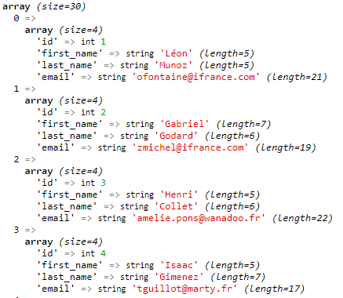

# **PRATIQUE POO**

La POO permet d'avoir un meilleur organisation grâce aux fonctions.

## **Refactoriser le code sous forme de fonction :**

La factorisation permet de centraliser le code.

**index.php**
Connexion à la base de données avec la classe PDO.
Le tableau d'option indique : 
- Quand il y a une erreur renvoi moi l'erreur
- Attribut du mode exploitation par default comment afficher les données qui reviennent  de la requête SQL FETCH_ASSOC = sous forme de tableau associatif.

- Effectuer la requête SQL pour récuperer les articles

- **$pageTitle** a comme valeur "Accueil"
- **ob_start();** = est utilisé pour temporiser la sortie et permettre de contrôler ce qui est affiché avant qu’il ne soit envoyé au client. 

- **require** est dans le tampon , donc on ne peut pas afficher directement. On utilise **echo ob_get_clean()** pour afficher ce qui est dans le    
- **$pageContent = ob_get_clean();**  = lit le contenu courant du tampon de sortie et l’efface en même temps.On utilise la boucle  (**require('templates/articles/index.html.php');**) **Foreach** qui va nous permettre d'afficher notre article suite à notre requête : 

````html
<h1>Nos articles</h1>

<?php foreach ($articles as $article) : ?>
    <h2><?= $article['title'] ?></h2>
    <small>Ecrit le <?= $article['created_at'] ?></small>
    <p><?= $article['introduction'] ?></p>
    <a href="article.php?id=<?= $article['id'] ?>">Lire la suite</a>
    <a href="delete-article.php?id=<?= $article['id'] ?>" onclick="return window.confirm(`Êtes vous sur de vouloir supprimer cet article ?!`)">Supprimer</a>
<?php endforeach ?>
````

- **require('templates/layout.html.php');** est notre header:
````html
<!DOCTYPE html>
<html lang="en">

<head>
    <meta charset="UTF-8">
    <meta name="viewport" content="width=device-width, initial-scale=1.0">
    <meta http-equiv="X-UA-Compatible" content="ie=edge">
    <title>Mon superbe blog - <?= $pageTitle ?></title>
</head>

<body>
    <?= $pageContent ?>
</body>

</html>
````

Afin d'éviter les répétitions et avoir une meilleur évolution et gestion du code nous allons centraliser les élèments qui se répetent dans un dossier nommé libraries, qui contient le fichier database.php = la connexion à la base de données 
index.php
````php
$pdo = new PDO('mysql:host=localhost;dbname=blogpoo;charset=utf8', 'root', '', [
    PDO::ATTR_ERRMODE => PDO::ERRMODE_EXCEPTION,
    PDO::ATTR_DEFAULT_FETCH_MODE => PDO::FETCH_ASSOC
    ]);

````
database.php
````php
function getPdo(): PDO 
{
$pdo = new PDO('mysql:host=localhost;dbname=blogpoo;charset=utf8', 'root', '', [
    PDO::ATTR_ERRMODE => PDO::ERRMODE_EXCEPTION,
    PDO::ATTR_DEFAULT_FETCH_MODE => PDO::FETCH_ASSOC
    ]);
    return $pdo;
}
````
index.php : le require nous permet d'inclure notre fonction pour la connexion et **$pdo = getPdo()**  nous retourne le resultat de la fonction 
````php
require_once ('libraries\database.php');
$pdo = getPdo();
````
La même démarche est effectuée dans les fichers qui  vont utiliser cette fonction pour accéder à la base de données.(article,save comment,delete comment,delete article)

**index.php**
Pour l'affichage html nous allons également refactoriser le code en fonction :
````php
$pageTitle = "Accueil";
ob_start();
require('templates/articles/index.html.php');
$pageContent = ob_get_clean();

require('templates/layout.html.php');

**article.php**
$pageTitle = $article['title'];
ob_start();
require('templates/articles/show.html.php');
$pageContent = ob_get_clean();

require('templates/layout.html.php');
````
**utils.php**
Le $path = 'articles/show.php' est le chemin du fichier  qui va être utilisé.
Les variables $article, $commentaires, $article_id et $pageTitle pour que les variables soit reconnu par la fonction et non defini un array $variables = [] est crée dans la fonction 
````php
// render ('articles/show')
function render(string $path, array $variables = []){
    ob_start();
    require('templates/'. $path . '.html.php');
    $pageContent = ob_get_clean();

    require('templates/layout.html.php');
}
````
**article.php**
Lors de l'appel de fonction dans le fichier article.php nous indiquons  le $path et les variables qui seront nécéssaires pour l'affichage du fichier show.html.php sous forme de tableau associatif.
````php
render('articles/show',
    ['pageTitle'=>$pageTitle, 
     'article'=> $article,
     'commentaires'=>$commentaires, 
    'article_id' =>$article_id]);
````
Pour éviter la répétition du tableau associatif à partir du nom des variables désirées on peut utiliser la **fonction compact**:
````php
render('articles/show',compact('pageTitle', 'article','commentaires', 'article_id'));
//équivalent : compact('pageTitle = > $pageTitle, etc)
````

**utils.php**
Pour passer le tableau association en variable il faut utiliser la fonction  **extract()**,elle créera automatiquement des variables avec ces noms et les valeurs correspondantes, il sortira les clés et valeurs du tableau associatif sous forme de variable

````php
// render ('articles/show')
function render(string $path, array $variables = []){
    extract($variables);
    ob_start();
    require('templates/'. $path . '.html.php');
    $pageContent = ob_get_clean();

    require('templates/layout.html.php');
}
````
index.php : ne pas oublier le require du fichier utils .php qui contient la **fonction render()**:

````php
require_once ('libraries/utils.php');

$pageTitle = "Accueil";
render('articles/index', compact('pageTitle', 'articles'));
````

Un fonction de redirection va être créer les fichiers concernés sont delete-article,delete-comment, save-comment :
**:void indique que la fonction ne retourne rien**
````php
function redirect(string $url): void {
    header("Location: $url");
    exit();
}
````
````php
/**
 * 5. Redirection vers la page d'accueil
 */
header("Location: index.php");
exit();
````
````php
/**
 * 5. Redirection vers l'article en question
 */
header("Location: article.php?id=" . $article_id);
exit();
````
````php
// 4. Redirection vers l'article en question :
header('Location: article.php?id=' . $article_id);
exit();
````
Ne pas oublier le require sur chaque fichier concerné
````php
require_once('libraries/utils.php');
````

````php
// delete-article
redirect("index.php");
// delete-comment
redirect("article.php?id=" . $article_id);
// save-comment
redirect("article.php?id=" . $article_id);
````
## **Refactoriser des requêtes SQL**:

**index.php**
````php
$resultats = $pdo->query('SELECT * FROM articles ORDER BY created_at DESC');
// On fouille le résultat pour en extraire les données réelles
$articles = $resultats->fetchAll();
````
Nous créeons une fonction pour centraliser pour obtenir le résulat de notre requête :
 **$pdo = getPdo();** PDO sera ce que va retourner la **function Pdo**, en effet **$pdo** de notre function findAllArticles n'était pas défini
 **: array** indique que la fonction va nous retourner un tableau
**database.php**
````php
  /**function findAllArticles() qui va nous permettre de récuperer les tous les articles de la table article
   * classer par date de création
   * @return array
  */
function findAllArticles(): array {
    $pdo = getPdo();
    $resultats = $pdo->query('SELECT * FROM articles ORDER BY created_at DESC');
    // On fouille le résultat pour en extraire les données réelles
    $articles = $resultats->fetchAll();
    return $articles;
}
````
La fonction est appelée  dans index.php et utilisée partout où il faudrait afficher toutes les publications.
De plus  **$pdo = getPdo();** peut être effacé car la fonction pour la connexion à la BDD est intégré à notre fonction
````php
$articles = findAllArticles();
````
l'index.php est beaucoup plus lisible...
````php
/**
 * CE FICHIER A POUR BUT D'AFFICHER LA PAGE D'ACCUEIL !
 * 
 * On va donc se connecter à la base de données, récupérer les articles du plus récent au plus ancien (SELECT * FROM articles ORDER BY created_at DESC)
 * puis on va boucler dessus pour afficher chacun d'entre eux
 */
require_once ('libraries/database.php');
require_once ('libraries/utils.php');

/**
 * 2. Récupération des articles
 */
$articles = findAllArticles();

/**
 * 3. Affichage
 */
$pageTitle = "Accueil";
render('articles/index' , compact('pageTitle', 'articles'));
````

**article.php**
nous allons effectuer la même démarche  mais avec une variable $id, ce qui permet d'afficher un seul article plutôt que contient une page unique pour afficher un seul.
````php
$query = $pdo->prepare("SELECT * FROM articles WHERE id = :article_id");
// On exécute la requête en précisant le paramètre :article_id 
$query->execute(['article_id' => $id]);
// On fouille le résultat pour en extraire les données réelles de l'article
$article = $query->fetch();
````
**database.php**
````php
/**findArticle(int $id):array = sert à recuperer un article via son id et le contenu correspondant à l'id*/
function findArticle(int $id){
    $pdo = getPdo();
    $query = $pdo->prepare("SELECT * FROM articles WHERE id = :article_id");
// On exécute la requête en précisant le paramètre :article_id 
    $query->execute(['article_id' => $id]);
// On fouille le résultat pour en extraire les données réelles de l'article
    $article = $query->fetch();
    return $article;
}
````
**article.php**
````php
 require_once ('libraries/database.php');
 require_once ('libraries/utils.php');
/**
 * 1. Récupération du param "id" et vérification de celui-ci
 */
// On part du principe qu'on ne possède pas de param "id"
$article_id = null;

// Mais si il y'en a un et que c'est un nombre entier, alors c'est cool
if (!empty($_GET['id']) && ctype_digit($_GET['id'])) {
    $article_id = $_GET['id'];
}

// On peut désormais décider : erreur ou pas ?!
if (!$article_id) {
    die("Vous devez préciser un paramètre `id` dans l'URL !");
}

/**
 * 3. Récupération de l'article en question
 * On va ici utiliser une requête préparée car elle inclue une variable qui provient de l'utilisateur : Ne faites
 * jamais confiance à ce connard d'utilisateur ! :D
 */
$article = findArticle($article_id);

/**
 * 4. Récupération des commentaires de l'article en question
 * Pareil, toujours une requête préparée pour sécuriser la donnée filée par l'utilisateur (cet enfoiré en puissance !)
 */
$commentaires = findAllComments($article_id);

/**
 * 5. On affiche 
 */
$pageTitle = $article['title'];

render('articles/show',compact ('pageTitle', 'article','commentaires', 'article_id'));
````
**delete-article.php**
````php
$query = $pdo->prepare('DELETE FROM articles WHERE id = :id');
$query->execute(['id' => $id]);
````
**database.php**
````php
/*function suppression de l'article par son $id et ne renvoi rien*/
function deleteArticle(int $id) : void {
    $pdo = getPdo();
    $query = $pdo->prepare('DELETE FROM articles WHERE id = :id');
    $query->execute(['id' => $id]);
}
````
**delete-comment.php**
````php
    $query = $pdo->prepare('SELECT * FROM comments WHERE id = :id');
    $query->execute(['id' => $id]);
````
**database.php**
````php
/* Vérification de l'existence du commentaire par son id */
function findComment(int $id){
    $pdo = getPdo();
    $query = $pdo->prepare('SELECT * FROM comments WHERE id = :id');
    $query->execute(['id' => $id]);
    $comment = $query->fetch();
    return $comment;
}
````
````php
$query = $pdo->prepare('DELETE FROM comments WHERE id = :id');
    $query->execute(['id' => $id]);
````
````php
/* fichier delete-comment function qui va permettre de recuperer 
*l'id de l'article avant de supprimer le commentaire*/
function deleteComment (int $id) : void {
    $pdo = getPdo();
    $query = $pdo->prepare('DELETE FROM comments WHERE id = :id');
    $query->execute(['id' => $id]);
}
````
**save-comment**
````php
 $query = $pdo->prepare('INSERT INTO comments SET author = :author, 
        content = :content, article_id = :article_id, created_at = NOW()');
        $query->execute(compact('author', 'content', 'article_id'));
````
**database.php**
````php
/* save-comment / function qui va permettre d'inserer un commentaire dans chaque champ de type string string $author,
* string $content,string $article_id */
    function insertComment(string $author,string $content,string $article_id) : void {
        $pdo = getPdo();
        $query = $pdo->prepare('INSERT INTO comments SET author = :author, 
        content = :content, article_id = :article_id, created_at = NOW()');
        $query->execute(compact('author', 'content', 'article_id'));
    }
````
## **Les classes**(models):
L'organisation du code utilisera le **MVC**
Models = pour l'accès aux données 
**Controller** = il va gérer l'interaction  entre les vues et les modèles et l'utilisateur
Classe statiques = pour les utilities
Dans la programmation orienté objet on parle de model de données lorsque on veut accéder à des donner (bdd,fichier, xml...).
Nous créeons le fichier "Article.php" avec un A majuscule car c'est une classe.
Il va s'y trouver les données qui servent à manipuler les données des articles

La **public function findAllArticles() : array{}** = elle est mise en public pour pouvoir être appelé
L'ensemnle des functions qui correspondant aux articles sont dans un seul est même fichier, cela facilite l'organisation et rend le code beaucoup plus lisible :
**Article.php**
````php
require_once ('libraries/database.php');
class Article {
     /** index.php : function findAllArticles() qui va nous permettre 
    * de récuperer les tous les articles de la table article
    * classer par date de création
   * @return array
  */
public function findAllArticles() : array {
    $pdo = getPdo();
    $resultats = $pdo->query('SELECT * FROM articles ORDER BY created_at DESC');
    // On fouille le résultat pour en extraire les données réelles
    $articles = $resultats->fetchAll();
    return $articles;
}

/** article.php = findArticle(int $id):array = sert a recuperer 1 article 
 * via son id et le contenu correspondant à l'id 
 * sous forme de tableau
 * @param integer $id
 * @return void 
 */
public function findArticle(int $id){
  $pdo = getPdo();
  $query = $pdo->prepare("SELECT * FROM articles WHERE id = :article_id");
// On exécute la requête en précisant le paramètre :article_id 
  $query->execute(['article_id' => $id]);
// On fouille le résultat pour en extraire les données réelles de l'article
  $article = $query->fetch();
  return $article;
}

/*delete-article.php function qui recevra l'id de l'article et ne renvoi rien*/
public function deleteArticle(int $id) : void {
  $pdo = getPdo();
  $query = $pdo->prepare('DELETE FROM articles WHERE id = :id');
  $query->execute(['id' => $id]);
}
}
````
**Comment.php**
````php

require_once ('libraries/database.php');

class Comment{
    /** article.php findAllComments nous permet de recuperer les commentaires 
 * qui correspondent à l'identifiant de l'article 
 * @return array
*/
public function findAllWithArticle(int $article_id) : array {
    $pdo = getPdo();
    $query = $pdo->prepare("SELECT * FROM comments WHERE article_id = :article_id");
    $query->execute(['article_id' => $article_id]);
    $commentaires = $query->fetchAll();
    return $commentaires;
}


/** Vérification de l'existence du commentaire par son id
*@param integer $id
*/
public function find(int $id){
    $pdo = getPdo();
    $query = $pdo->prepare('SELECT * FROM comments WHERE id = :id');
    $query->execute(['id' => $id]);
    $comment = $query->fetch();
    return $comment;
  }

/**  save-comment / function qui va permettre d'inserer un commentaire dans la base de données
* @param string $author
* @param string $content
* @param integer $article_id
* @param void
 */
    public function insert(string $author,string $content,string $article_id) : void {
        $pdo = getPdo();
        $query = $pdo->prepare('INSERT INTO comments SET author = :author, 
        content = :content, article_id = :article_id, created_at = NOW()');
        $query->execute(compact('author', 'content', 'article_id'));
    }

    /**  delete-comment function qui va permettre de recuperer l'id de 
*l'article avant de le supprimer et qui ne renvoi rien
 * @param integer $id
 * @return void */
public function delete(int $id) : void {
    $pdo = getPdo();
    $query = $pdo->prepare('DELETE FROM comments WHERE id = :id');
    $query->execute(['id' => $id]);
  }
}
````
Les nom des méthodes sont modifiés donc il fauit bien penser à les actualiser dans les fichiers concernés pour chaque function appelée.

Pour éviter la répétition de **$pdo= getPdo()** dans différentes fonction de notre objet Article, nous allons refactoriser cette méthode qui sera appliquée dès la naissance de notre objet,
Le constructeur nous permet cela (comportement appelé dès que l'on crée une  instance de cette class)
````php
private $pdo;
public function __construct() {
  $this->pdo = getPdo();
}
// Exemple sur une fonction 
public function findAll() : array {
    $resultats = $this->pdo->query('SELECT * FROM articles ORDER BY created_at DESC');
    // On fouille le résultat pour en extraire les données réelles
    $articles = $resultats->fetchAll();
    return $articles;
}
````

Le code ci dessus va être mis en commun pour nos deux objets, nous créeons un fichier Models.php qui contiendra donc ce code que l'on va faire hérité à nos deux classes :
**Models.php**
````php
require_once ('libraries/database.php');
class Model {
    protected $pdo;
    public function __construct() {
    $this->pdo = getPdo();
  }
}
````
La propriété utilisele mot clé protected afin de permettre au classe fille de pouvoir utilisé cette function extends nous permet cela : 
**Comment.php**
````php
class Comment extends Model
````
Ne pas oublier de supprimer les require de la database  des fichers Article et Comment en effet le fichier Model sera require dans chaque classe et Model devra bien évidemmment avoir le require connexion à la database.
````php
 require_once ('libraries/database.php');
class Model {
    protected $pdo;
    public function __construct() {
    $this->pdo = getPdo();
  }
}
````

## Classes et Héritage :
La **fonction find** va être mise en commun sur le principe de la méthode de l'héritage grace à notre class parent Model : 
**Article.php**
````php
public function find(int $id){
    $query = $this->pdo->prepare("SELECT * FROM articles WHERE id = :article_id");
  // On exécute la requête en précisant le paramètre :article_id 
    $query->execute(['article_id' => $id]);
  // On fouille le résultat pour en extraire les données réelles de l'article
    $article = $query->fetch();
    return $article;
  }
````

**Model.php**
````php
// $table à le mot clé protected car elle sera utilisée unqiuement par es classes qui héritent de Model
protected $table;

public function find(int $id){
    $query = $this->pdo->prepare("SELECT * FROM {$this->table} WHERE id = :id");
  // On exécute la requête en précisant le paramètre :article_id 
    $query->execute(['id' => $id]);
  // On fouille le résultat pour en extraire les données réelles de l'article
    $item = $query->fetch();
    return $item;
  }
````
**Article.php** et **Comment.php**:
````php
protected  $table = 'articles';
protected  $table = 'comments';
````

La **function delete** sera aussi refactoriser afin qu'elle soit utiliser par les deuc lasses sur le principe de l'héritage
````php
public function delete(int $id) : void {
    $query = $this->pdo->prepare("DELETE FROM {$this->table} WHERE id = :id");
    $query->execute(['id' => $id]);
  }
````
La **function findAll** est également refactoriser
**Articles**
````php
  public function findAll() : array {
    $resultats = $this->pdo->query('SELECT * FROM articles ORDER BY created_at DESC');
    // On fouille le résultat pour en extraire les données réelles
    $articles = $resultats->fetchAll();
    return $articles;
}
````
La **function findAll** on va indique qu'elle peut recevoir **$order = ""**
et si la variable $order n'est pas vide, on ajoute **"ORDER BY"** et  et la phrase ajoutée à **. $order;**
````php
  public function findAll(?string $order = "") : array {
    $sql = "SELECT * FROM {$this->table}";
    if($order){
        $sql .= " ORDER BY "  . $order;
    }
    $resultats = $this->pdo->query($sql);
    // On fouille le résultat pour en extraire les données réelles
    $articles = $resultats->fetchAll();
    return $articles;
}
````
**index.php**
On indique **$order** dans notre fichier **index.php** la où est appelée notre function
````php
 /** 2. Récupération des articles
 */
$articles = $model->findAll("created_at DESC");
````
la classe Model est dynamique car elle agit sur les tables.

La classe User est crée elle va nous permettre de récupérer l'intégralité de la table users, toujours en utilisant le méthode de l'héritage :
**User.php**
````php
require_once('libraries/models/Model.php');
class User extends Model{
    // On indique quelle table  doit être appelé quand on veut traiter des utilisateurs
    protected $table = "users";
}
````
**index.php** on appel la fonction **findAll**
````php
require_once ('libraries/models/User.php');
$userModel = new User();
$users = $userModel->findAll();
var_dump($users);
die();
````
Tous les utilisateur s'affiche sous forme d'un tableau associatif :


La class Model est une idée, pour empêcher qu' un developpeur utilise la class Model on empêche la création d'objet (l'instancie)  dans la class Model on utilise  l'abstraction :
````php
abstract class Model{}
````
## Les Namespaces : 
